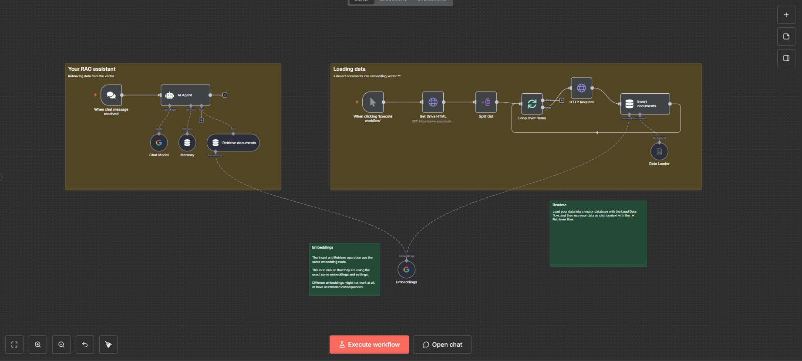

# n8n-automation-workflows

This repository contains a collection of my experimental automation workflows built with n8n, demonstrating practical applications of automation and AI integration in business processes.

## Some of my Workflows

### 1. [Bewerbungsfilter (Application Filter)](./Gmail_label_filtering/README.md)
A sophisticated email filtering system for job applications with three different approaches:

- **Keyword Version**: Simple but rigid filtering based on subject keywords like "Bewerbung" and "Job"
- **AI Version**: Uses Gemini API for intelligent classification with balanced cost-efficiency
- **AI Tools Version**: Advanced AI agent orchestration for maximum flexibility

Key features:
- Automated Gmail integration
- Smart classification of incoming emails
- Cost-effective AI implementation
- Customizable labeling system

#### Keyword Version Workflow

#### AI Version Workflow

#### AI Tools Version Workflow

### 2. [FutureTech Newsletter](./FutureTech_newsletter/README.md)
An automated tech newsletter generation and distribution system featuring:

- Automated content generation using Gemini 2.5 Flash
- Duplicate prevention through Google Docs integration
- HTML email formatting
- Automated distribution
- Topic tracking and management

#### FutureTech Newsletter Workflow

### 3. [Book Summarizer Workflow](./Book_summarizer/README.md)
An intelligent book summarization system with two different approaches:

- **External State Version**: Utilizes external state management for efficient book processing
- **Node Static Data Version**: Uses n8n's built-in static data, Simple implementation

Key features:
- Automated book processing
- Intelligent summarization
- State management for large documents
- Node Static Data

#### External State Version Workflow

#### Node Static Data Version Workflow

### 4. [Personal Data Extractor](./Extract_personal_data/README.md)
An automated personal data extraction system featuring:

- Automated extraction of personal information from documents
- AI-powered data parsing and recognition
- Structured data output
- Automated processing workflow
- Data validation and verification

Key features:
- Document format handling
- AI-powered information extraction
- Data validation and verification
- Structured output generation
- Privacy-compliant processing

#### Personal Data Extractor Workflow

### 5. [Web Content Saver](./Web_content_saver/README.md)
An automated web content saving and summarization system featuring:

- Form-triggered content submission
- AI-powered summarization using Gemini and DeepSeek
- Automated saving to Google Docs

#### Web Content Saver Workflow

### 6. [RAG Based AI Assistant](./RAG_based_ai_assistant/README.md)
An intelligent Retrieval-Augmented Generation (RAG) AI assistant featuring:

- Chat-based interface for user queries
- Data retrieval from Google Drive knowledge base
- AI-powered responses based on retrieved context

#### RAG Based AI Assistant Workflow

## Getting Started

To use these workflows:

1. Create a qorkflow in n8n portal
2. Import the desired JSON workflow file
3. Configure your credentials for:
   - Gmail (for email workflows)
   - Google Docs (for newsletter workflow)
   - Gemini API (for AI features)
4. Customize the workflow parameters as needed

## Notes

- These workflows are experimental and may need adjustments for your specific use case
- API costs should be considered when implementing AI-based solutions
- Regular monitoring is recommended for optimal performance

## License

This project is open-source and available for reference and learning purposes.